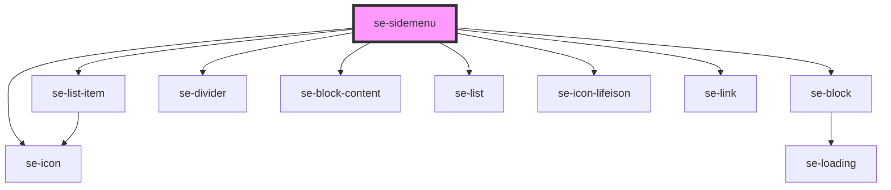

# se-sidemenu

<!-- Auto Generated Below -->

## Properties

| Property | Attribute | Description                                                                            | Type     | Default        |
| -------- | --------- | -------------------------------------------------------------------------------------- | -------- | -------------- |
| `label`  | `label`   | Defines the text displayed in the header of the Sidemenu. The default value is `Menu`. | `string` | `'Menu'`       |
| `link`   | `link`    |                                                                                        | `string` | `'www.se.com'` |

## Methods

### `toggle(itemName?: string) => Promise<void>`

Toggle the sidemenu. Optionally, pass the `item` or `id` of a sidemenu-item to open that particular menu item.
ex: document.getElementById("main-sidemenu").toggle("side-about");

#### Returns

Type: `Promise<void>`

## Dependencies

### Depends on

- [se-list-item](../list-item)
- [se-block](../block)
- [se-icon](../icon)
- [se-divider](../divider)
- [se-block-content](../block-content)
- [se-list](../list)
- [se-icon-lifeison](../icon-lifeison)
- [se-link](../link)

### Graph

----------------------------------------------

*Built with [StencilJS](https://stenciljs.com/)*
