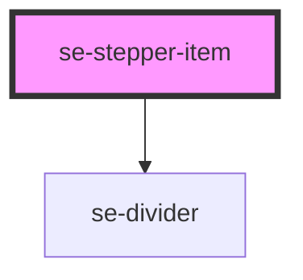

# se-stepper-item

<!-- Auto Generated Below -->

## Properties

| Property   | Attribute  | Description                                                                                                                                                                                                     | Type      | Default     |
| ---------- | ---------- | --------------------------------------------------------------------------------------------------------------------------------------------------------------------------------------------------------------- | --------- | ----------- |
| `isLast`   | `is-last`  | Indicates whether or not the stepper item is the last item in the stepper component.  The default setting is `false`.                                                                                           | `boolean` | `false`     |
| `label`    | `label`    | Indicates the label for your stepper item.                                                                                                                                                                      | `string`  | `undefined` |
| `required` | `required` | Indicates whether or not this is a required section of your stepper component. If set to `true`, the next step will not be accessible until the data in this step is completed. The default setting is `false`. | `boolean` | `false`     |

## Events

| Event      | Description                                                            | Type               |
| ---------- | ---------------------------------------------------------------------- | ------------------ |
| `didClick` | Event to send to the parent component when clicking on a stepper item. | `CustomEvent<any>` |

## Dependencies

### Depends on

- [se-divider](../divider)

### Graph

----------------------------------------------

*Built with [StencilJS](https://stenciljs.com/)*
