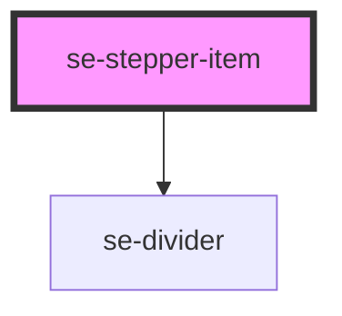

# se-stepper-item

<!-- Auto Generated Below -->

## Properties

| Property   | Attribute  | Description                                                                                                                                                                                                                                  | Type      | Default     |
| ---------- | ---------- | -------------------------------------------------------------------------------------------------------------------------------------------------------------------------------------------------------------------------------------------- | --------- | ----------- |
| `active`   | `active`   | Indicates whether or not a stepper item has been selected.                                                                                                                                                                                   | `boolean` | `undefined` |
| `disabled` | `disabled` | Indicates whether or not a stepper item has been disabled.                                                                                                                                                                                   | `boolean` | `undefined` |
| `isLast`   | `is-last`  | Indicates whether or not the stepper item is the last item in the stepper component.  The default setting is `false`.                                                                                                                        | `boolean` | `false`     |
| `label`    | `label`    | Indicates the label for your stepper item.                                                                                                                                                                                                   | `string`  | `undefined` |
| `required` | `required` | Indicates whether or not this is a required section of your stepper component.  The default setting is `false`. If set to `true`, the next step will not be accessible until the input fields associated with this step have been validated. | `boolean` | `false`     |
| `step`     | `step`     | Indicates the numerical position of the stepper item within the stepper component.                                                                                                                                                           | `number`  | `undefined` |

## Events

| Event      | Description                                                                                                                                     | Type               |
| ---------- | ----------------------------------------------------------------------------------------------------------------------------------------------- | ------------------ |
| `didClick` | Event to send to the parent component when clicking on a stepper item. This event emits the stepper item element object and its label property. | `CustomEvent<any>` |

## Dependencies

### Depends on

- [se-divider](../divider)

### Graph

----------------------------------------------

*Built with [StencilJS](https://stenciljs.com/)*
