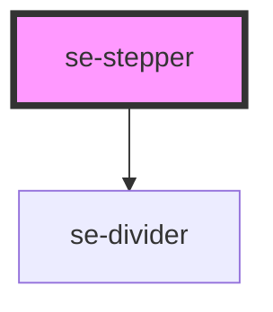

# se-stepper

<!-- Auto Generated Below -->

## Properties

| Property | Attribute | Description                                                                                                                                                                                                                                                                            | Type                         | Default     |
| -------- | --------- | -------------------------------------------------------------------------------------------------------------------------------------------------------------------------------------------------------------------------------------------------------------------------------------- | ---------------------------- | ----------- |
| `color`  | `color`   | Sets the background color of your stepper. The default setting is `primary`, implementing a green background for the stepper visual items. The `alternative` setting implements a white background for the stepper visual items.  This setting is best used against a gray background. | `"alternative" \| "primary"` | `'primary'` |
| `linear` | `linear`  | Defines if the stepper items must be completed sequentially.  The default setting is `false`.                                                                                                                                                                                          | `boolean`                    | `false`     |

## Methods

### `next(validate: boolean) => Promise<void>`

Call the `next` method to navigate to the next step from the step that is currently selected.
This will not work if the next step is required and not validated.

#### Returns

Type: `Promise<void>`

### `previous() => Promise<void>`

Call the `previous` method to navigate to the previous step from the step that is currently selected.

#### Returns

Type: `Promise<void>`

### `reset(step?: number) => Promise<void>`

Call the `reset` method to reset the stepper to the first step.  This also invalidates any validated steps.

#### Returns

Type: `Promise<void>`

## Dependencies

### Depends on

- [se-divider](../divider)

### Graph

----------------------------------------------

*Built with [StencilJS](https://stenciljs.com/)*
